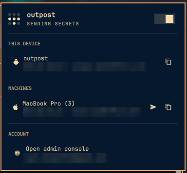

# omarchy-tailscale

[](https://github.com/igor-alexandrov/omarchy-tailscale/actions/workflows/ci.yml)
[](LICENSE)
[](https://omarchy.org/)

A Tailscale widget for the [Omarchy](https://omarchy.org/) bar — the Linux
equivalent of the Tailscale menu bar icon on macOS.

Click the icon to see your account, this device, and every machine on your
tailnet with its Tailscale IP.



*Addresses are blurred in the screenshot.*

## Features

- Connection state in the bar, with a Tailscale mark drawn natively as a
  theme-coloured 3×3 dot grid
- **This device** — host name, OS, Tailscale IP and MagicDNS name, with
  one-click IP copy
- **Machines** — every peer on the tailnet with its IP and DNS name. Online
  first; offline machines are dimmed and tagged rather than hidden
- **Account** — the signed-in account, and a row that opens the admin console
- Copy a machine's Tailscale IP, host name, or DNS name
- Left click opens the panel, right click toggles Tailscale on/off
- Switch between Tailscale accounts when more than one is available
- Exit node selection, including Mullvad exit nodes
- Send files with Taildrop, when the tailnet allows file sharing

## Install

```bash
omarchy plugin add git@github.com:igor-alexandrov/omarchy-tailscale.git --enable
```

Then place it in the bar if you want it somewhere specific:

```bash
omarchy bar move igor-alexandrov.tailscale --section right
```

Update later with `omarchy plugin update igor-alexandrov.tailscale`.

## Uninstall

```bash
omarchy plugin remove igor-alexandrov.tailscale
```

That disables the widget, takes it out of the bar, and deletes the plugin
directory. To keep the plugin installed but hide it, disable it instead:

```bash
omarchy plugin disable igor-alexandrov.tailscale
```

Widget settings are not stored in the plugin directory: the refresh interval and
your recently used Mullvad exit nodes live in the bar layout in
`~/.config/omarchy/shell.json`, the same place Omarchy keeps the settings of its
own widgets. Removing the plugin takes its entry out of the bar; edit that file
if you want to be sure nothing is left. The plugin writes nothing anywhere else.

> Plugins run as unsandboxed code inside the long-lived `omarchy-shell`
> process. Read the source before enabling this, or any other plugin.

## Requirements

- Omarchy 4.x with the Quickshell-based `omarchy-shell`
- `tailscale` CLI on `PATH`
- `wl-copy` (`wl-clipboard`) for the copy actions
- `xdg-open` for opening the admin console
- Taildrop enabled on the tailnet, to send files

## Keyboard shortcuts

With the panel open:

| Key | Action |
|-----|--------|
| `j` / `k` or arrows | Move the cursor |
| `enter` / `space` | Activate the current row |
| `c` | Copy the selected machine's IP |
| `n` | Copy the selected machine's name |
| `d` | Copy the selected machine's DNS name |
| `s` | Send files to the selected machine |
| `a` | Open the Tailscale admin console |
| `t` | Toggle Tailscale |
| `r` | Refresh status |
| `esc` | Close |

## Opening the panel by command

Omarchy's own bar panels cannot be opened over IPC: they set
`manageIpc: false`, so the handler registered for their target does not drive
the panel and `ipc call <target> open` is accepted but does nothing. This plugin
registers an `IpcHandler` of its own, so it can be scripted or bound to a key:

```bash
qs -p /usr/share/omarchy/shell ipc call igor-alexandrov.tailscale toggle
qs -p /usr/share/omarchy/shell ipc call igor-alexandrov.tailscale open
qs -p /usr/share/omarchy/shell ipc call igor-alexandrov.tailscale adminConsole
```

## Receiving files

Incoming Taildrop files are saved to `~/Downloads` by Omarchy's
`omarchy-tailscale-receive` service, which announces each one with a
notification. Enable it with `systemctl --user enable --now
omarchy-tailscale-receive`, or run the same loop by hand with
`omarchy tailscale receive`.

## Development

The plugin is plain QML plus one JavaScript module, loaded directly by
`omarchy-shell`:

| File | Role |
|------|------|
| `Panel.qml` | Bar widget and popup panel — all of the UI |
| `Service.qml` | Runs the `tailscale` CLI and holds state |
| `Model.js` | Pure parsing of `tailscale status --json`; node-loadable, so it can be unit tested outside the shell |
| `TailscaleIcon.qml` | The bar icon |
| `manifest.json` | Plugin id, kinds, entry point, bar widget settings |

To work on it, point the plugin directory at your checkout:

```bash
ln -s ~/path/to/omarchy-tailscale ~/.config/omarchy/plugins/igor-alexandrov.tailscale
```

**Saving a file is not enough to see UI changes.** The shell logs
`Local plugin changed, reloading`, but it does not re-create the already
instantiated bar panel, so the old UI keeps rendering and newly added
`IpcHandler` children never register. Run `omarchy restart shell` after editing,
then reopen the panel.

### Checks

```bash
bin/check
```

Runs everything, skipping any step whose tooling is missing rather than failing:

| Step | Needs | Covers |
|------|-------|--------|
| `node --check Model.js` | node | Syntax |
| `test/model-test.js` | node | `Model.js` parsing, against synthetic fixtures |
| `test/manifest-test.js` | node | The rules `omarchy plugin validate` enforces, plus entry points on disk and the IPC target matching the plugin id |
| `omarchy plugin validate .` | Omarchy | The authoritative manifest check |
| `qmllint` | Qt 6 | QML errors |

CI runs `bin/check` on every push and pull request. A stock runner has neither
Omarchy nor Qt 6, so the last two steps are local-only — run `bin/check` on your
Omarchy machine before releasing.

Two notes on qmllint, which cost some time to work out:

- Use **Qt 6's** binary at `/usr/lib/qt6/bin/qmllint`. On Arch, `/usr/bin/qmllint`
  is Qt 5's and exits 255 with no output on any Quickshell file.
- `import qs.Ui` only resolves if the shell tree is visible under a directory
  literally named `qs`, so `bin/check` builds a symlink farm for it.

Warnings are reported but do not fail the run: the upstream code this is derived
from carries ~157 of them, nearly all `unqualified` access and `missing-property`
against the `Style` singleton's nested objects, which qmllint cannot introspect.
Errors do fail.

The fixtures in `test/fixtures/` are hand-written. Keep them that way — real
`tailscale status --json` output carries node public keys, account addresses and
your tailnet name, none of which belong in a public repository.

## Credits

Derived from the first-party `omarchy.tailscale` widget in
[Omarchy](https://github.com/basecamp/omarchy) by Basecamp, which is MIT
licensed. This fork adds the *This device* and *Account* sections, lists offline
machines instead of hiding them, and adds the `a` shortcut and the IPC target.

MIT licensed — see [LICENSE](LICENSE).
